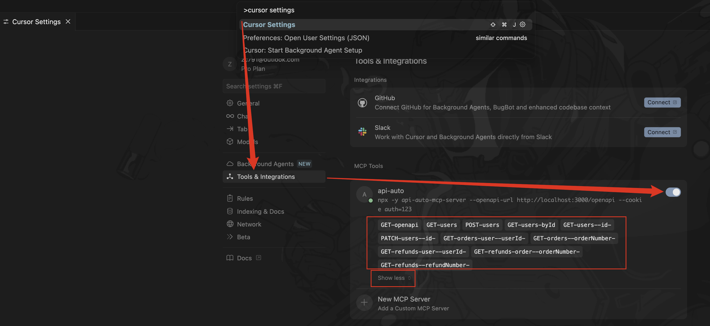

# API Auto MCP Server Demo

This is a demo project for testing and demonstrating the features of [API Auto MCP Server](https://github.com/RJiazhen/api-auto-mcp-server).

## Quick Start

### Prerequisites

- `Bun` >= 1.2 (recommended) or `Node.js` >= 22
- Cursor >= 0.46.8 or VSCode >= 1.99.3 (requires the GitHub Copilot extension enabled)

### Install Dependencies

Run the following command in the project root directory to install dependencies:

```bash
bun install # Recommended
# or
npm install
```

### Start the Server

Open the project in an IDE like VSCode or Cursor, and **press F5 to run (recommended)**.

Alternatively, you can start the server by running the following command in the root directory:

```bash
bun dev # Recommended
# or
npm run dev
```

### Access the Service

Once the server is running, visit http://localhost:3000/api-docs to view the API documentation.

### Start the MCP Server

#### Cursor

If you are using Cursor, open the `Cursor Settings` -> `MCP` menu, locate the MCP server named `api-auto`, and enable it. Once enabled, various tools will become available.



#### VSCode

If you are using VSCode, open the GitHub Copilot chat window and click the refresh button. When prompted with `Trust MCP Server from api-auto-mcp-server-demo/.cursor/mcp.json?`, click `Trust`. The refresh button will change to a wrench icon with a number displayed.


#### Other IDEs

For other IDEs, refer to their respective documentation to configure the MCP server.

### Start Interacting

You can now use the AI features within your IDE to ask questions about this service.

## About API Auto MCP Server

API Auto MCP Server is an MCP server that generates configurations based on API configuration files. For more information, visit [API Auto MCP Server](https://github.com/RJiazhen/api-auto-mcp-server).
