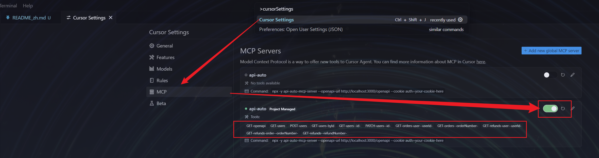
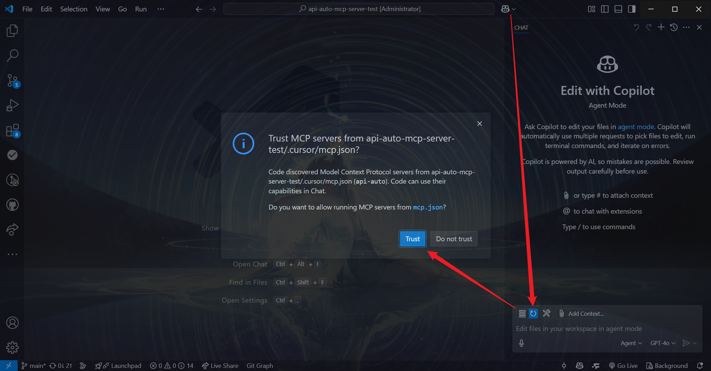

# API Auto MCP Server Demo

[API Auto MCP Server](https://github.com/RJiazhen/api-auto-mcp-server)的测试demo，用于演示和测试API Auto MCP Server的功能。

## 快速开始

### 运行环境

- `Bun` >= 1.2 （推荐） 或 `Node.js` >= 22
- Cursor >= 0.46.8 或 VScode >= 1.99.3（需要启用Github Copilot插件）

### 安装依赖

在项目根目录下，执行以下命令安装依赖：

```bash
bun install # 推荐
# 或
npm install
```

### 启动服务

使用VScode或Cursor等IDE打开该项目后，**按F5运行（推荐）**。

或在根目录下执行以下命令启动服务：

```bash
bun dev # 推荐
# 或
npm run dev
```

### 访问服务

服务启动成功后，访问http://localhost:3000/api-docs，可以看到接口文档页面

### 启动MCP服务器

#### Cursor

如果是使用Cursor打开该项目，根据下图示意，打开`Cursor Settings`-`MCP`，找到名为`api-auto`的MCP服务器，将其设置为开启状态，如果开启成功了，则会出现各种可用的Tools。


#### VScode

如果是使用VScode打开该项目，打开Github Copilot的聊天窗口，点击刷新按钮，出现提示`Trust MCP Server from api-auto-mcp-server-demo/.cursor/mcp.json?`，点击`Trust`。然后就可以看到刷新按钮变为扳手按钮，并出现数字。



#### 其他IDE

其他IDE请参考其对应的文档，配置MCP服务器。

### 开始对话

接下来你就可以使用IDE内部的AI提问该服务相关的内容了


## 关于Api Auto MCP Server

Api Auto MCP Server是一个能根据接口配置文件生成对应配置的MCP服务器，更多信息请访问[Api Auto MCP Server](https://github.com/RJiazhen/api-auto-mcp-server)。


